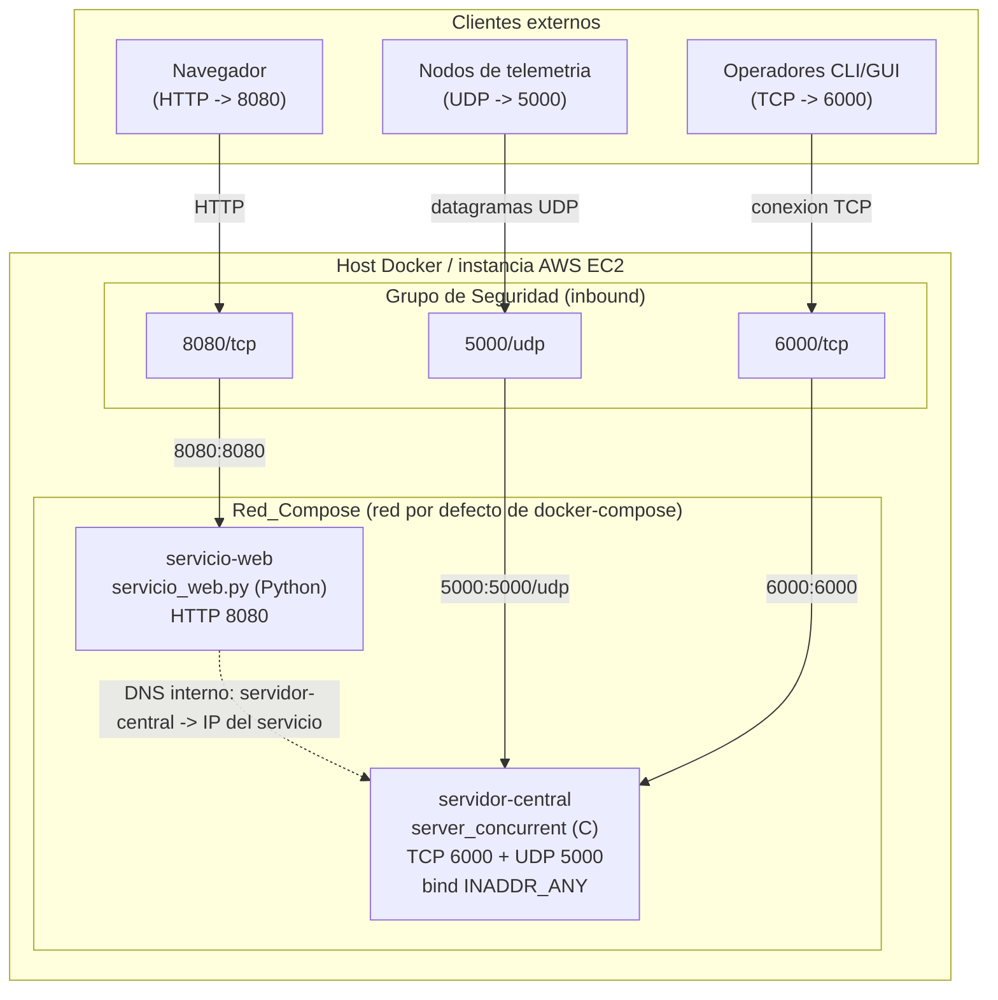

# Design Document

## Overview

Este diseño cubre el **Punto 9 del enunciado**: contenerizar el **Servidor_Central** en C (binario `server/server_concurrent`) y orquestar el sistema completo con `docker-compose`, sin modificar la lógica de la aplicación.

Objetivos del diseño:

- **Contenerizar el Servidor_Central sin tocar el código C.** El servidor ya lee sus puertos del entorno mediante `puerto_desde_entorno("TSP_TCP_PORT", 6000)` y `puerto_desde_entorno("TSP_UDP_PORT", 5000)`, enlaza a `INADDR_ANY` (todas las interfaces) y aborta el arranque con `perror` si el `bind` falla. Por tanto, **no se requiere ningún cambio en `server_concurrent.c`, `protocol.c`, `registry.c` ni `handlers.c`** (Req. 6.6, 6.7 del enunciado; Req. 2.1, 2.2, 2.6, 2.7 de este spec). La configurabilidad por variables de entorno **ya existe** en el código.
- **Definir un `server/Dockerfile` multi-etapa** que compile el binario en una Etapa_Compilacion con la cadena de herramientas y lo ejecute en una Etapa_Ejecucion mínima que no contenga compilador (Req. 1).
- **Ampliar el `docker-compose.yml`** existente añadiendo el servicio `servidor-central` como hermano del `servicio-web` ya definido, en la misma red de compose, con resolución por nombre DNS interno y publicación de TCP `6000` y UDP `5000` (Req. 3, Req. 4).
- **Documentar el despliegue en AWS EC2**: instalación de Docker y del complemento Compose, reglas de entrada del grupo de seguridad para `6000/tcp`, `5000/udp` y `8080/tcp`, y verificación posterior (Req. 5, Req. 6).

> Nota sobre el rango de puertos: el código C actual acepta cualquier puerto `> 0` y cae al valor por defecto ante entradas inválidas emitiendo un mensaje `[CONFIG]` por `stderr`. Los requisitos estrechan la intención de validación a `1024-65535`, pero **este diseño no modifica el código**: la validación efectiva sigue siendo la del binario existente. La contenerización solo aporta valores por defecto sensatos vía `ENV` y las variables inyectadas por compose.

## Architecture

El sistema se ejecuta sobre un host Docker (típicamente una instancia AWS EC2). Ambos servicios comparten la red por defecto de compose (`Red_Compose`), que provee DNS interno: el `servicio-web` resuelve `servidor-central` por nombre, nunca por IP fija (Req. 4.1-4.3). Los puertos se publican al host y el grupo de seguridad de EC2 los abre a Internet.



Notas de arquitectura:

- **Publicación de puertos**: `servidor-central` publica `6000:6000` (TCP) y `5000:5000/udp`; `servicio-web` conserva `8080:8080` (TCP). El host enruta el tráfico entrante a los contenedores (Req. 3.3, 3.4, 3.5).
- **Resolución DNS**: la comunicación `servicio-web -> servidor-central` ocurre **dentro** de la Red_Compose usando el nombre de servicio como host (`TSP_SERVER_HOST=servidor-central`). No se publica ni se requiere el puerto `6000` en el host para esta ruta interna; la publicación al host es solo para clientes externos (Req. 4.2, 4.3).
- **Sin IP fija**: ni el código ni la configuración embeben una IP pública; el despliegue en EC2 se apoya en el DNS de compose para el tráfico interno y en la IP/DNS de la instancia para el tráfico externo (Req. 6.6).

## Components and Interfaces

### 1. `server/Dockerfile` — construcción multi-etapa (Req. 1, Req. 2.5, Req. 7)

**Etapa_Compilacion (builder).** Contiene la cadena de herramientas (gcc + make). Copia `server/` y el `Makefile` del contexto de build (raíz del repo) e invoca el objetivo `server` del Makefile, que ya fija `-Wall -Wextra -O2` y enlaza `-pthread` (Req. 1.2, 1.3, 7.5). Se recomienda **usar `make server` en vez de invocar `gcc` directamente** para mantener una única fuente de verdad de las opciones de compilación: si el Makefile cambia sus flags, la imagen los hereda sin desincronizarse.

- Imagen base recomendada: `gcc:14-bookworm` (o `debian:bookworm` + `apt-get install build-essential make`). Se elige la familia **Debian/glibc** deliberadamente para que el binario resultante enlace contra la misma implementación de libc/pthread que la etapa de ejecución.
- Si `make server` finaliza con código distinto de cero, la instrucción `RUN` falla y **Docker aborta la construcción sin producir imagen final** (Req. 1.4, 7.7). Esto es comportamiento nativo de Docker: un `RUN` con salida no-cero detiene el build.

**Etapa_Ejecucion (runtime).** Imagen mínima que copia **solo** el binario `server/server_concurrent` desde la etapa builder.

- Imagen base recomendada: `debian:bookworm-slim`. Justificación:
  - El binario está enlazado dinámicamente contra **glibc + libpthread**, ambas presentes en `debian:*-slim` (Req. 1.6).
  - **No se usa `alpine`**: Alpine usa **musl libc**, no glibc. Un binario compilado en una etapa glibc puede fallar en tiempo de ejecución sobre musl por incompatibilidad de la libc. Mantener glibc en ambas etapas (build y runtime) evita ese riesgo.
  - **No se usa distroless**: aunque es aún más pequeña, la variante mínima de Debian slim ya cumple el requisito (glibc + pthread presentes) y facilita diagnósticos (shell disponible) sin arrastrar la cadena de herramientas.
  - `slim` **no incluye gcc ni un gestor de paquetes de compilación**, por lo que un intento de invocar el compilador dentro del contenedor falla (Req. 1.5, 1.7).
- Declara valores por defecto: `ENV TSP_TCP_PORT=6000` y `ENV TSP_UDP_PORT=5000`.
- Declara `EXPOSE 6000/tcp` y `EXPOSE 5000/udp` (Req. 1.8, 2.5).
- `CMD` ejecuta el binario y lo mantiene como proceso principal del contenedor, p. ej. `CMD ["/app/server_concurrent"]` (ruta absoluta tras `WORKDIR /app`), de modo que el proceso quede en primer plano (Req. 1.9).
- Todos los comentarios en español y con referencia al Punto 9 (Req. 1.10, 7.1).

**Justificación del multi-etapa:** la imagen final contiene únicamente el binario y las bibliotecas de tiempo de ejecución; la cadena de herramientas (gcc, make, headers) queda confinada a la etapa builder y **no llega a la imagen publicada**, cumpliendo el objetivo de imagen pequeña sin toolchain (Req. 1 historia de usuario, Req. 1.5, 1.7).

Estructura prevista del `server/Dockerfile`:

```dockerfile
# server/Dockerfile — Contenerizacion del Servidor_Central (Punto 9).
# Construccion multi-etapa: se compila con la cadena de herramientas en la
# Etapa_Compilacion y se ejecuta un binario minimo en la Etapa_Ejecucion.

# --- Etapa_Compilacion: compila server_concurrent con el Makefile ---
FROM gcc:14-bookworm AS builder
WORKDIR /src
# Se copian las fuentes del servidor y el Makefile (contexto = raiz del repo).
COPY Makefile ./Makefile
COPY server/ ./server/
# Se invoca el objetivo `server` del Makefile (unica fuente de verdad de flags:
# -Wall -Wextra -O2 -pthread). Si falla, el build se aborta (Req. 1.4, 7.7).
RUN make server

# --- Etapa_Ejecucion: imagen minima con glibc + pthread, sin compilador ---
FROM debian:bookworm-slim AS runtime
WORKDIR /app
# Solo se copia el binario ya compilado (sin toolchain) (Req. 1.5, 1.6, 1.7).
COPY --from=builder /src/server/server_concurrent /app/server_concurrent
# Puertos por defecto configurables por entorno (Req. 2.1-2.4).
ENV TSP_TCP_PORT=6000
ENV TSP_UDP_PORT=5000
# Exposicion de puertos del proceso (Req. 1.8, 2.5).
EXPOSE 6000/tcp
EXPOSE 5000/udp
# El proceso queda en primer plano como comando por defecto (Req. 1.9).
CMD ["/app/server_concurrent"]
```

### 2. `docker-compose.yml` — orquestación (Req. 3, Req. 4)

Se **conserva** el servicio `servicio-web` existente y se **añade** el servicio `servidor-central`. Ambos quedan en la red por defecto de compose (Red_Compose), que provee DNS interno. Se añade `depends_on` para que el servidor arranque antes que el web.

Estructura final prevista:

```yaml
services:
  # Servidor_Central en C contenerizado (Punto 9).
  servidor-central:
    build:
      context: .                      # raiz del repo (Req. 3.2)
      dockerfile: server/Dockerfile
    environment:
      - TSP_TCP_PORT=6000
      - TSP_UDP_PORT=5000
    ports:
      - "6000:6000"                   # TCP registro/comandos/alertas (Req. 3.3)
      - "5000:5000/udp"               # UDP telemetria (Req. 3.4)

  # Servicio_Web en Python (Punto 7), ya existente.
  servicio-web:
    build:
      context: .
      dockerfile: web/Dockerfile
    depends_on:
      - servidor-central              # arranque ordenado
    environment:
      # Localizacion por nombre DNS de compose, nunca IP fija (Req. 4.1-4.3).
      - TSP_SERVER_HOST=servidor-central
      - TSP_TCP_PORT=6000
      - WEB_PORT=8080
    ports:
      - "8080:8080"                   # HTTP (Req. 3.5)
```

- **DNS interno**: `servicio-web` usa `TSP_SERVER_HOST=servidor-central`; compose resuelve el nombre a la IP del contenedor del servidor dentro de la Red_Compose (Req. 4.1, 4.2, 4.3, 3.6).
- **Arranque conjunto**: `docker compose up` levanta ambos servicios hasta ejecución (Req. 3.7). `depends_on` ordena el arranque; no garantiza readiness, y por eso el `servicio-web` ya tolera fallos de conexión (Req. 4.5).
- Comentarios en español referenciando el Punto 9 (Req. 3.9, 7.2).

### 3. Integración con el sistema de build (Req. 7.5)

La Etapa_Compilacion invoca `make server`, no `gcc` directo. El objetivo `server` del Makefile produce `server/server_concurrent` a partir de las cuatro fuentes con los flags canónicos. Ventaja: una única fuente de verdad de opciones de compilación entre build local y build en contenedor (Req. 7.3, 7.5).

### 4. `.dockerignore` (contexto de build magro)

Como el contexto de build es la raíz del repo, conviene un `.dockerignore` para reducir el tamaño del contexto enviado al demonio Docker y evitar copiar artefactos innecesarios o binarios locales dentro de la imagen:

```
.git
**/__pycache__
server/server_concurrent
server/*.o
server/client_tcp_test
server/client_udp_test
```

Esto también refuerza que el binario `server_concurrent` compilado localmente **no** se filtre a la imagen (se recompila en el builder) y complementa que el binario permanezca fuera del control de versiones (Req. 7.4).

### 5. Componente de despliegue en AWS EC2 (Req. 6)

- **Instalar Docker** y verificar con `docker --version` (Req. 6.1).
- **Instalar el complemento Compose** y verificar con `docker compose version` (Req. 6.2).
- **Grupo de Seguridad (reglas de entrada)** con origen `0.0.0.0/0`:
  - `6000/tcp` (Req. 6.3)
  - `5000/udp` (Req. 6.4)
  - `8080/tcp` (Req. 6.5)
- **Sin IP fija embebida**: la localización interna es por DNS de compose; los clientes externos usan la IP/DNS pública de la instancia, no una IP embebida en el código (Req. 6.6).
- **Verificación post-despliegue** desde un equipo externo (Req. 6.7): comprobar alcance de `6000/tcp`, `5000/udp` y `8080/tcp`.

## Data Models

### Contrato de variables de entorno

| Variable          | Valor por defecto | Ámbito                     | Consumidor          | Notas |
|-------------------|-------------------|----------------------------|---------------------|-------|
| `TSP_TCP_PORT`    | `6000`            | Contenedor servidor y web  | `server_concurrent`, `servicio_web.py` | El servidor lo lee vía `puerto_desde_entorno`; entrada inválida cae al defecto con mensaje `[CONFIG]` (Req. 2.1, 2.3) |
| `TSP_UDP_PORT`    | `5000`            | Contenedor servidor        | `server_concurrent` | Puerto de telemetría; entrada inválida cae al defecto (Req. 2.2, 2.4) |
| `TSP_SERVER_HOST` | `servidor-central`| Contenedor web             | `servicio_web.py`   | Nombre DNS del servicio de compose, nunca IP fija (Req. 4.1, 4.3) |
| `WEB_PORT`        | `8080`            | Contenedor web             | `servicio_web.py`   | Puerto HTTP de escucha del Servicio_Web (existente) |

### Mapeo de puertos

| Puerto contenedor | Protocolo | Puerto host | Regla en Grupo_Seguridad | Requisito |
|-------------------|-----------|-------------|--------------------------|-----------|
| 6000              | TCP       | 6000        | `6000/tcp` (0.0.0.0/0)   | 3.3, 6.3  |
| 5000              | UDP       | 5000        | `5000/udp` (0.0.0.0/0)   | 3.4, 6.4  |
| 8080              | TCP       | 8080        | `8080/tcp` (0.0.0.0/0)   | 3.5, 6.5  |

## Error Handling

- **Fallo de compilación en el builder** (Req. 1.4, 7.7): si `make server` retorna código distinto de cero, el `RUN` falla y Docker **aborta el build sin generar imagen final**. El error de gcc queda visible en la salida del build.
- **Fallo de enlace de socket al arranque** (Req. 2.7): el binario ya emite `perror("[TCP] Error en bind")` / `[UDP] Error en bind`, cierra el descriptor y termina el arranque. El contenedor sale con estado de error, visible en `docker logs` / `docker compose logs`.
- **Puerto del host ya en uso al hacer `up`** (Req. 3.8): al publicar `6000/tcp`, `5000/udp` u `8080/tcp`, si el puerto del host está ocupado, Docker aborta el arranque del servicio afectado y emite un error indicando el puerto en conflicto (comportamiento nativo del motor de publicación de puertos).
- **Fallo de resolución DNS o conexión desde `servicio-web`** (Req. 4.5): el `servicio-web` registra el error y **continúa en ejecución** sin finalizar abruptamente; no depende de que el servidor esté listo en el instante del arranque.
- **Variable de puerto inválida** (Req. 2.3, 2.4): el servidor usa el valor por defecto correspondiente y registra el ajuste por `stderr` (`[CONFIG]`). No modificamos este comportamiento; el `ENV` del Dockerfile solo fija los defaults.
- **`TSP_SERVER_HOST` ausente/vacía en el web** (Req. 4.4): el `servicio-web` registra un error de configuración indicando la ausencia del host del servidor.

## Testing Strategy

La verificación es esencialmente de **configuración de contenedores e infraestructura**, no de lógica de negocio nueva. Se apoya en pruebas de build, de humo (smoke) y de integración con 1-3 ejemplos representativos.

**Aplicabilidad de pruebas basadas en propiedades (PBT).** No aplica a esta funcionalidad. Un `Dockerfile` y un `docker-compose.yml` son **configuración declarativa**, no funciones puras con relación entrada/salida sobre la que formular un "para todo entrada X, se cumple P(X)". La verificación adecuada son pruebas de humo/integración (build, arranque, alcance de puertos, resolución DNS). Las PBT existentes del `Servicio_Web` (Hypothesis, solo dependencia de desarrollo) **no se ven afectadas** por este cambio, ya que no se modifica su código.

**1. Construcción de la imagen (Req. 1, 5.1, 7.3)**
- `docker build -f server/Dockerfile -t servidor-central .` finaliza sin error y produce imagen etiquetada.
- Verificar tamaño reducido comparando con la imagen del builder (la final no debe contener toolchain).
- Verificar **ausencia de compilador** en runtime: `docker run --rm servidor-central sh -c "gcc --version"` (o `which gcc`) debe fallar (Req. 1.5, 1.7).

**2. Ejecución del contenedor (Req. 1.9, 5.2)**
- `docker run --rm -p 6000:6000 -p 5000:5000/udp servidor-central` deja el contenedor en ejecución; `docker ps` muestra el proceso vivo.

**3. Alcance de puertos (Req. 5.4, 5.5, 5.6)**
- TCP 6000: probar con `nc` o con `server/client_tcp_test` (registro/comando TSP).
- UDP 5000: probar con `server/client_udp_test` o con un nodo de telemetría (`clients/telemetry_node.py`) enviando un datagrama.
- HTTP 8080: `curl` al `servicio-web` responde.

**4. Orquestación conjunta (Req. 3.7, 4.2)**
- `docker compose up` levanta `servidor-central` y `servicio-web`.
- Verificar resolución DNS interna: desde `servicio-web`, `getent hosts servidor-central` (o el flujo del operador web) resuelve al servidor; el web opera sobre TCP hacia el servidor por nombre.

**5. Conflicto de puertos (Req. 3.8)**
- Ocupar `8080` en el host y ejecutar `docker compose up`; verificar que el arranque del servicio afectado se aborta con mensaje del puerto en conflicto.

**6. Despliegue EC2 (Req. 6)**
- Verificar `docker --version` y `docker compose version` en la instancia.
- Confirmar reglas de entrada `6000/tcp`, `5000/udp`, `8080/tcp` en el Grupo_Seguridad.
- Verificación externa: desde un equipo fuera de la instancia, comprobar alcance de los tres puertos contra la IP/DNS pública de EC2 (Req. 6.7).

**Cobertura de errores** (Req. 1.4, 2.7, 3.8): probar build con una fuente que no compile (falla el build), arranque con un puerto ya enlazado (el proceso sale con error registrado), y `up` con puerto de host ocupado (arranque abortado con mensaje).
