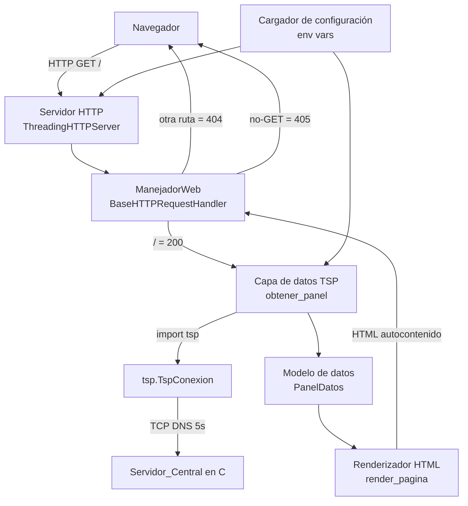
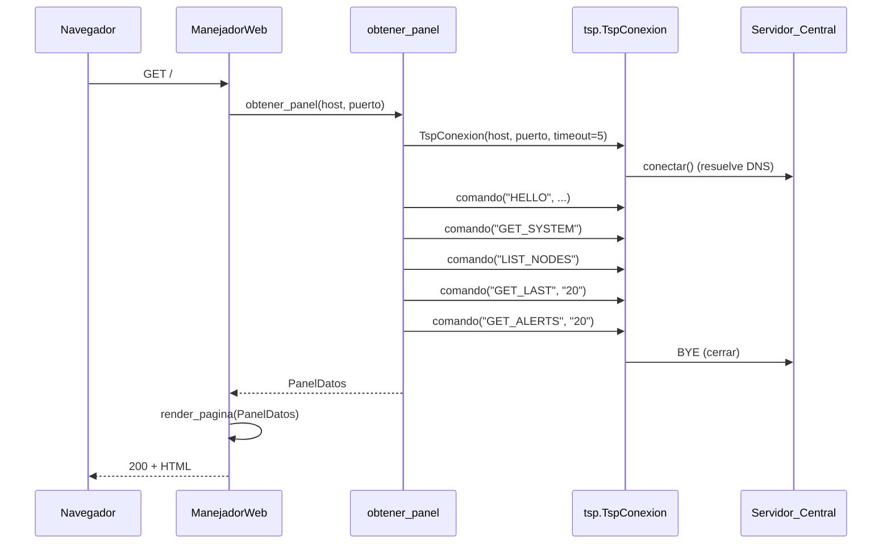
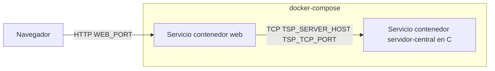

# Design Document

## Overview

El **Servicio_Web** (Punto 7) es un proceso Python que expone una interfaz HTTP básica para
consultar el estado del sistema de telemetría desde un navegador. No es una aplicación web
compleja: se apoya únicamente en la biblioteca estándar de Python (`http.server`, `socketserver`,
`threading`, `os`, `html`, `socket`) y actúa como **un cliente operador TSP más**. Reutiliza la
biblioteca `clients/tsp.py` para toda la comunicación TSP y **no reimplementa el protocolo** en
ninguna parte.

Cada petición HTTP GET a la raíz dispara una consulta al Servidor_Central: se abre una conexión TCP
propia, se envían `HELLO`, `GET_SYSTEM`, `LIST_NODES`, `GET_LAST` y `GET_ALERTS`, se parsean las
respuestas `(cabecera, registros)` a estructuras Python y se cierra la conexión con `BYE`. El
resultado se renderiza como una única página HTML autocontenida (CSS en línea, sin recursos externos
ni JavaScript). Si el Servidor_Central no responde, la página se sirve igualmente en **Estado
Degradado** con un mensaje de indisponibilidad, de modo que la interfaz siempre responde con HTTP 200
salvo en errores de ruta (404) o método (405).

El diseño prioriza cuatro cualidades exigidas por los requisitos:

- **Reutilización estricta de la Biblioteca_TSP** (Req. 9.2): el Servicio_Web importa `tsp` y usa
  `tsp.TspConexion` / `conexion.comando(...)`; no serializa ni parsea mensajes TSP a mano.
- **Localización por DNS y configuración por entorno** (Req. 2): host y puertos vienen de variables
  de entorno; el servidor se resuelve por nombre a través de `tsp.resolver`.
- **Robustez en Estado Degradado** (Req. 7): todo fallo de red o de protocolo se traduce en un
  resultado parcial o degradado, nunca en una excepción que tumbe el proceso.
- **Concurrencia** (Req. 8): `ThreadingHTTPServer` atiende varias peticiones a la vez y cada una
  abre y cierra su propia conexión TSP.

### Trazabilidad de alto nivel

| Decisión de diseño | Requisitos |
|---|---|
| Servidor HTTP con `ThreadingHTTPServer` de la biblioteca estándar | 1.1, 8.1, 9.1 |
| Handler que distingue ruta `/`, otras rutas y otros métodos | 1.1, 1.2, 1.3 |
| Cargador de configuración por variables de entorno con validación de puertos | 2.1–2.9 |
| Capa de obtención de datos que reutiliza `tsp.TspConexion` | 3.1, 4.1, 5.1, 6.1, 9.2 |
| Conexión TSP propia por petición (abrir + `BYE`) | 8.2 |
| Timeout de 5 s en la conexión TSP | 7.4 |
| Traducción de errores de red/DNS/timeout a Estado Degradado | 1.4, 7.1, 7.3 |
| Traducción de `TspError` a error por sección | 7.2 |
| Renderizador HTML con `html.escape` de todos los datos | 1.1, 3.2, 4.2, 5.2, 6.2 |
| Ubicación en `web/` sin dependencias externas | 9.3, 9.4 |

## Architecture

### Ubicación en el repositorio y estrategia de importación

El Servicio_Web vive en la carpeta `web/` (Req. 9.3), hermana de `clients/`:

```
Telematica-2026-2/
├── clients/
│   ├── tsp.py            <- Biblioteca_TSP (se reutiliza tal cual)
│   └── operator_cli.py   <- referencia de cómo se consumen (cabecera, registros)
└── web/
    └── servicio_web.py   <- Servicio_Web (Punto 7)
```

Como `web/` y `clients/` son carpetas hermanas, `import tsp` no funciona directamente desde `web/`.
El módulo `tsp.py` no está empaquetado como paquete instalable, así que el Servicio_Web debe añadir
la carpeta `clients/` al `sys.path` **antes** de importar `tsp`. La resolución se hace de forma
relativa al propio archivo, no al directorio de trabajo, para que funcione igual ejecutándose a mano
o dentro de un contenedor:

```python
import os
import sys

_DIR_CLIENTS = os.path.join(os.path.dirname(os.path.abspath(__file__)), "..", "clients")
sys.path.insert(0, os.path.abspath(_DIR_CLIENTS))

import tsp  # noqa: E402  (import tras ajustar sys.path)
```

**Alternativa de despliegue:** en Docker se puede fijar `PYTHONPATH=/app/clients` en la imagen y
dejar el `import tsp` limpio. El diseño soporta ambos: la inserción en `sys.path` es la ruta por
defecto (funciona sin variables extra) y `PYTHONPATH` es la ruta preferida en contenedores porque no
mezcla lógica de rutas con el código. Se elige la inserción en `sys.path` como mecanismo primario
porque cumple Req. 9.4 (sin requerir configuración externa al intérprete) y Req. 9.2 (reutiliza la
biblioteca, no la copia).

### Vista de componentes



### Flujo de una petición



Cada petición usa su **propia** `TspConexion` (Req. 8.2). Como `ThreadingHTTPServer` crea un hilo por
petición, no hay estado TSP compartido entre hilos y no se necesitan bloqueos sobre el socket.

### Modelo de concurrencia (Req. 8)

Se usa `http.server.ThreadingHTTPServer`, que combina `HTTPServer` con `socketserver.ThreadingMixIn`:
cada conexión entrante se atiende en un hilo dedicado. Esto satisface Req. 8.1 (varias peticiones en
paralelo) sin escribir un pool de hilos a mano. Los hilos se crean como `daemon` (comportamiento por
defecto del mixin en versiones actuales) para que un `Ctrl-C` cierre el proceso limpiamente. Como
cada hilo abre su propia conexión TCP al Servidor_Central y la cierra al terminar (Req. 8.2), las
peticiones concurrentes son independientes.

## Components and Interfaces

El Servicio_Web se organiza en cinco componentes, todos en el módulo `web/servicio_web.py` (o
repartidos en submódulos equivalentes). Las firmas son orientativas.

### 1. Cargador de configuración

Lee las variables de entorno al arrancar y valida los puertos. Aborta el arranque con un mensaje
claro si un puerto es inválido (Req. 2.5, 2.8).

```python
@dataclass(frozen=True)
class Config:
    tsp_host: str      # TSP_SERVER_HOST, por defecto "localhost"
    tsp_port: int      # TSP_TCP_PORT,   por defecto 6000, rango 1..65535
    web_port: int      # WEB_PORT,       por defecto 8080, rango 1..65535

def parsear_puerto(nombre_var: str, valor: str | None, defecto: int) -> int:
    """Devuelve un puerto válido o lanza ConfigError con nombre y rango.
    Si valor es None -> defecto. Si no es entero 1..65535 -> ConfigError."""

def cargar_config(entorno: Mapping[str, str]) -> Config:
    """Construye Config desde un mapping de entorno (os.environ por defecto)."""
```

- `parsear_puerto` es una función **total y pura** sobre `(nombre, valor, defecto)`: para cualquier
  cadena de entrada devuelve un puerto válido o lanza `ConfigError`; nunca devuelve un puerto fuera
  de rango. Recibe el entorno como parámetro para ser testeable sin tocar `os.environ`.
- El mensaje de error incluye el nombre de la variable y el rango permitido (Req. 2.5, 2.8), p. ej.
  `TSP_TCP_PORT debe ser un entero en el rango 1-65535 (recibido: 'abc')`.
- **Trazabilidad:** Req. 2.1–2.8.

### 2. Capa de obtención de datos (cliente TSP)

Función que, dados host y puerto, abre una conexión TSP, ejecuta los comandos y devuelve un
`PanelDatos`. Traduce cualquier fallo a un resultado degradado o parcial.

```python
def obtener_panel(host: str, puerto: int, timeout: float = 5.0,
                  n_ultimas: int = 20, n_alertas: int = 20) -> PanelDatos:
    """Abre tsp.TspConexion(host, puerto, timeout=timeout), envía HELLO y luego
    GET_SYSTEM, LIST_NODES, GET_LAST, GET_ALERTS. Parsea cada (cabecera,
    registros) al modelo y cierra con BYE. Nunca propaga excepciones de red."""
```

Comportamiento:

- Abre `tsp.TspConexion(host, puerto, timeout=timeout, verbose=False)` con `timeout=5.0` (Req. 7.4).
  El `timeout` del socket cubre la conexión TCP y cada `recv` de la lectura de respuesta; la
  resolución DNS ocurre en `tsp.resolver` (Req. 2.9).
- Envía `HELLO|servicio-web` como primer mensaje (sección 4.3 del protocolo). La cabecera de la
  respuesta `OK|HELLO|<SERVER_ID>|TSP/1.0|<UPTIME_SEG>` se guarda como metadato del servidor.
- Ejecuta los cuatro comandos vía `conexion.comando(...)`, que devuelve `(cabecera, registros)` tal y
  como los consume `operator_cli.py`.
- **Manejo de errores por capas:**
  - `ConnectionError`, `socket.gaierror` (DNS), `socket.timeout` / `TimeoutError` al **conectar** →
    `PanelDatos` en Estado Degradado (`disponible = False`) con un mensaje de indisponibilidad
    (Req. 1.4, 7.1). No se ejecuta ningún comando.
  - `tsp.TspError` en un comando concreto → esa sección queda con `error = (codigo, descripcion)` y el
    resto de comandos se siguen ejecutando (Req. 7.2). La conexión sigue viva (sección 5.1 del
    protocolo).
  - `tsp.TspProtocolError` o error de red **a mitad** de sesión → se marca la sección afectada como
    fallida y se degradan las secciones que no alcanzaron a ejecutarse.
- Cierra siempre con `conexion.cerrar()` (envía `BYE`) en un bloque `finally`, incluso si hubo error
  (Req. 8.2).
- **Trazabilidad:** Req. 3.1, 4.1, 5.1, 6.1, 7.1–7.4, 8.2, 9.2.

Correspondencia comando → parseo (basada en `operator_cli.py`):

| Comando | Registro | Campos consumidos (referencia) |
|---|---|---|
| `GET_SYSTEM` | `STAT|CLAVE|VALOR` | `cmd_system`: `r[1]=clave`, `r[2]=valor` |
| `LIST_NODES` | `NODE|ID|ESTADO|TIPO|UBICACION|HACE_SEG|MSGS|PERDIDOS` | `cmd_nodes`: `r[1..7]`, filtra `len(r) < 8` |
| `GET_LAST` | `MEAS|NODE_ID|VAR|VALOR|UNIDAD|TIMESTAMP` | `cmd_last`: `r[1..5]`, filtra `len(r) < 6` |
| `GET_ALERTS` | `EVENT|NODE_ID|TIPO_ALERTA|VALOR|TIMESTAMP|SEVERIDAD` | `cmd_alerts`: `r[1..5]`, filtra `len(r) < 6` |

El parseo replica la tolerancia de `operator_cli.py`: los registros con menos campos de los esperados
se descartan en lugar de lanzar `IndexError`.

### 3. Manejador HTTP

Subclase de `http.server.BaseHTTPRequestHandler`.

```python
class ManejadorWeb(BaseHTTPRequestHandler):
    config: Config  # inyectada al construir el servidor

    def do_GET(self): ...      # / -> 200 + HTML ; otra ruta -> 404
    def do_HEAD(self): ...     # opcional, mismos códigos sin cuerpo
    # Cualquier otro método (POST, PUT, ...) -> 405
```

- En `do_GET`, se parsea la ruta con `urllib.parse.urlsplit`; si el `path` es `/` (con o sin query),
  se llama a `obtener_panel(...)` y luego a `render_pagina(...)`, y se responde 200 con
  `Content-Type: text/html; charset=utf-8` (Req. 1.1). El error del servidor central no cambia el
  código: sigue siendo 200 con página degradada (Req. 1.4, 7.1, 7.3).
- Ruta distinta de `/` → 404 con cuerpo HTML mínimo (Req. 1.2).
- Métodos distintos de GET/HEAD → 405. Se implementa sobreescribiendo el despacho o definiendo
  `do_POST`, `do_PUT`, etc. que responden 405; se incluye la cabecera `Allow: GET, HEAD` (Req. 1.3).
- Se sobreescribe `log_message` para un log conciso y se captura cualquier excepción inesperada del
  render para responder 200 degradado en lugar de 500 (defensa en profundidad de Req. 7.3).
- **Trazabilidad:** Req. 1.1, 1.2, 1.3, 1.4.

### 4. Renderizador HTML

Construye una página HTML autocontenida a partir de un `PanelDatos`.

```python
def render_pagina(panel: PanelDatos, refresh_seg: int | None = None) -> str:
    """Devuelve el HTML completo (str). CSS en línea, sin JS ni recursos
    externos. Escapa TODO dato con html.escape."""
```

- Secciones: **Estado del servidor** (los 9 `STAT`), **Nodos** (registrados/activos + tabla),
  **Últimas mediciones** (tabla) y **Alertas recientes** (tabla). Cada tabla se ordena en el orden
  recibido del servidor (Req. 5.3, 6.3).
- **Escapado obligatorio:** todos los valores provienen de la red y son no confiables, así que cada
  celda pasa por `html.escape(...)` antes de insertarse (Req. 1.1; propiedad de seguridad).
- **Banner degradado:** si `panel.disponible` es `False`, se muestra un banner de indisponibilidad
  del Servidor_Central en lugar de los datos (Req. 1.4, 7.1).
- **Error por sección:** si una sección tiene `error`, se muestra el código y la descripción del
  `TspError` en esa sección y se renderizan normalmente las demás (Req. 7.2).
- **Auto-actualización opcional:** se puede incluir `<meta http-equiv="refresh" content="N">` para
  refrescar la página cada `N` segundos, sin JavaScript.
- **Trazabilidad:** Req. 1.1, 3.2, 4.2, 4.3, 4.4, 5.2, 5.3, 6.2, 6.3, 7.1, 7.2.

### 5. Arranque (main)

```python
def main() -> int:
    try:
        config = cargar_config(os.environ)
    except ConfigError as exc:
        print(f"[web] {exc}", file=sys.stderr)
        return 2  # aborta el arranque (Req. 2.5, 2.8)
    servidor = ThreadingHTTPServer(("", config.web_port), _fabricar_handler(config))
    servidor.serve_forever()
```

- El puerto de escucha es `config.web_port` (Req. 2.6, 2.7, 9.4). Se enlaza a `""` (todas las
  interfaces) para ser accesible dentro de un contenedor.
- La `Config` se inyecta al handler mediante una fábrica (closure o `functools.partial`) porque
  `BaseHTTPRequestHandler` se instancia por petición.
- **Trazabilidad:** Req. 2.5, 2.6, 2.7, 2.8, 9.1, 9.4.

## Data Models

Se usan `dataclasses` de la biblioteca estándar. Todos los campos textuales se guardan como `str`
crudo tal como llega del servidor; la conversión a número solo se intenta donde aporta valor
(contadores derivados) y con degradación segura.

```python
@dataclass(frozen=True)
class EstadoSistema:
    """Los 9 indicadores STAT de GET_SYSTEM (sección 4.8)."""
    valores: dict[str, str]          # clave STAT -> valor crudo
    # Claves esperadas: UPTIME_SEG, NODOS_REGISTRADOS, NODOS_ACTIVOS,
    # OPERADORES_CONECTADOS, TELEMETRIA_RECIBIDA, TELEMETRIA_RECHAZADA,
    # TELEMETRIA_PERDIDA_EST, COMANDOS_TCP, ALERTAS_GENERADAS

@dataclass(frozen=True)
class NodoInfo:
    """Registro NODE de LIST_NODES (sección 4.4)."""
    id: str
    estado: str          # ONLINE | OFFLINE
    tipo: str
    ubicacion: str
    hace_seg: str
    msgs: str
    perdidos: str

@dataclass(frozen=True)
class Medicion:
    """Registro MEAS de GET_LAST (sección 4.6)."""
    node_id: str
    variable: str
    valor: str
    unidad: str
    timestamp: str

@dataclass(frozen=True)
class Alerta:
    """Registro EVENT de GET_ALERTS (sección 4.7)."""
    node_id: str
    tipo_alerta: str
    valor: str
    timestamp: str
    severidad: str

@dataclass(frozen=True)
class SeccionError:
    """Error TSP de una sección concreta (Req. 7.2)."""
    codigo: int
    descripcion: str

@dataclass(frozen=True)
class PanelDatos:
    """Resultado completo de una petición. En Estado Degradado, disponible=False."""
    disponible: bool                     # False -> Servidor_Central inalcanzable
    mensaje_degradado: str | None        # texto del banner cuando disponible=False
    server_id: str | None                # de OK|HELLO|<SERVER_ID>|...
    sistema: EstadoSistema | None
    error_sistema: SeccionError | None
    nodos: list[NodoInfo]
    error_nodos: SeccionError | None
    nodos_registrados: int               # derivado: len(nodos) o STAT NODOS_REGISTRADOS
    nodos_activos: int                   # derivado: nodos con estado == "ONLINE"
    mediciones: list[Medicion]
    error_mediciones: SeccionError | None
    alertas: list[Alerta]
    error_alertas: SeccionError | None
```

**Campos derivados (Req. 4.3, 4.4):**

- `nodos_registrados` = número total de registros `NODE` recibidos (equivalente al `len(filas)` de
  `cmd_nodes`).
- `nodos_activos` = número de `NodoInfo` con `estado == "ONLINE"` (comparación insensible a
  mayúsculas, según regla R7 del protocolo).

**Layouts de registro de referencia** (posición → campo), tal como los define `docs/PROTOCOLO.md` y
los consume `operator_cli.py`:

```
NODE |ID           |ESTADO |TIPO      |UBICACION|HACE_SEG|MSGS|PERDIDOS   (sección 4.4)
MEAS |NODE_ID      |VAR    |VALOR     |UNIDAD   |TIMESTAMP                (sección 4.6)
EVENT|NODE_ID      |TIPO_ALERTA|VALOR |TIMESTAMP|SEVERIDAD                (sección 4.7)
STAT |CLAVE        |VALOR                                                 (sección 4.8)
OK   |HELLO        |SERVER_ID|TSP/1.0 |UPTIME_SEG                         (sección 4.3)
```

Como `tsp.decodificar` separa por `|`, el campo posición 0 es el tipo y los datos empiezan en la
posición 1. El parseo tolera registros más cortos de lo esperado descartándolos, y registros más
largos tomando solo las posiciones conocidas.

## Correctness Properties

*Una propiedad es una característica o comportamiento que debe cumplirse en todas las ejecuciones
válidas de un sistema; en esencia, un enunciado formal de lo que el sistema debe hacer. Las
propiedades son el puente entre la especificación legible por humanos y las garantías de corrección
verificables por máquina.*

Estas propiedades se derivan del análisis de prework. Las partes del sistema con lógica pura y
espacio de entrada amplio (validación de puertos, parseo tolerante de registros, render y escapado
HTML, y la garantía de degradación segura) son adecuadas para pruebas basadas en propiedades. El
manejo de rutas/métodos, la lectura de variables por defecto, el cableado de comandos y la
concurrencia se cubren con pruebas de ejemplo e integración (ver Testing Strategy).

### Property 1: HTML bien formado para cualquier panel

*Para cualquier* `PanelDatos` (disponible, degradado o con errores por sección), `render_pagina`
devuelve una cadena HTML bien formada (parseable por un parser HTML sin lanzar) que contiene las
cuatro secciones esperadas: Estado del servidor, Nodos, Últimas mediciones y Alertas recientes.

**Validates: Requirements 1.1**

### Property 2: Escapado total de datos no confiables

*Para cualquier* `PanelDatos` cuyos campos contengan caracteres arbitrarios (incluidos `<`, `>`, `&`,
`"`, `'`), el HTML producido por `render_pagina` no contiene esos caracteres sin escapar dentro del
contenido de datos; todo dato aparece pasado por `html.escape`.

**Validates: Requirements 1.1, 3.2, 4.2, 5.2, 6.2**

### Property 3: Degradación segura — obtener_panel nunca lanza

*Para cualquier* comportamiento de la conexión TSP subyacente (que lance `ConnectionError`,
`socket.gaierror`, `socket.timeout`/`TimeoutError`, `tsp.TspProtocolError` o cierre a mitad de
sesión), `obtener_panel` termina sin propagar la excepción y devuelve un `PanelDatos`; cuando el
fallo ocurre al conectar, el panel tiene `disponible == False` y un mensaje de indisponibilidad.

**Validates: Requirements 1.4, 7.1, 7.3**

### Property 4: Error TSP parcial preserva las secciones sanas

*Para cualquier* subconjunto de comandos que respondan con `tsp.TspError` mientras los demás
responden correctamente, `obtener_panel` devuelve un `PanelDatos` con `disponible == True` en el que
cada sección afectada lleva un `SeccionError` (código y descripción) y cada sección no afectada lleva
sus datos; la función no propaga la excepción.

**Validates: Requirements 7.2, 7.3**

### Property 5: Validación de puerto total sobre las entradas

*Para cualquier* cadena de entrada y valor por defecto, `parsear_puerto` o bien devuelve un entero en
el rango 1–65535, o bien lanza `ConfigError`; nunca devuelve un valor fuera de rango ni propaga otra
excepción. Cuando el valor es `None` devuelve el defecto (que está en rango); cuando no es un entero
de 1 a 65535 lanza `ConfigError` cuyo mensaje incluye el nombre de la variable y el rango permitido.

**Validates: Requirements 2.3, 2.5, 2.6, 2.8**

### Property 6: Conteos de nodos derivados correctamente

*Para cualquier* lista de `NodoInfo`, `nodos_registrados` es igual a la longitud de la lista y
`nodos_activos` es igual a la cantidad de nodos cuyo `estado` es `ONLINE` (comparación insensible a
mayúsculas), y `0 <= nodos_activos <= nodos_registrados`.

**Validates: Requirements 4.3, 4.4**

### Property 7: Preservación del orden en tablas

*Para cualquier* lista de mediciones y de alertas recibida del servidor, el orden de aparición de las
filas en el HTML renderizado coincide con el orden de la lista de entrada (que el servidor entrega de
la más reciente a la más antigua).

**Validates: Requirements 5.3, 6.3**

### Property 8: Parseo tolerante de registros malformados

*Para cualquier* lista de registros crudos (`list[list[str]]`) incluyendo registros más cortos o más
largos de lo esperado, la capa de parseo no lanza: descarta los registros con menos campos de los
requeridos y toma solo las posiciones conocidas de los más largos, de forma coherente con
`operator_cli.py`.

**Validates: Requirements 4.2, 5.2, 6.2, 7.3**

## Error Handling

El principio rector es que **el Servicio_Web nunca cae por culpa del Servidor_Central**: cualquier
fallo de red, DNS, timeout o protocolo se traduce en una página HTTP 200 (degradada o parcial), y el
proceso sigue atendiendo peticiones (Req. 7.3).

### Errores de configuración (arranque)

- `parsear_puerto` lanza `ConfigError` con nombre de variable y rango cuando `TSP_TCP_PORT` o
  `WEB_PORT` no son enteros en 1–65535 (Req. 2.5, 2.8). `main` captura `ConfigError`, imprime el
  mensaje en `stderr` y retorna un código de salida distinto de cero (aborta el arranque). Este es el
  **único** caso en el que el proceso no arranca; una vez en marcha, ya no aborta por errores del
  servidor central.

### Errores por petición (en obtener_panel)

| Situación | Origen | Traducción | Requisito |
|---|---|---|---|
| No resuelve el DNS | `socket.gaierror` | Estado Degradado (`disponible=False`) | 7.1 |
| No conecta / conexión rechazada | `ConnectionError`, `OSError` | Estado Degradado | 1.4, 7.1 |
| Expira el timeout de 5 s | `socket.timeout` / `TimeoutError` | Estado Degradado | 7.1, 7.4 |
| El servidor cierra a mitad | `ConnectionError` de `leer_linea` | Estado Degradado o parcial | 7.1, 7.3 |
| Respuesta no conforme a TSP | `tsp.TspProtocolError` | Sección afectada marcada, resto degradado | 7.3 |
| Error TSP por comando | `tsp.TspError` | `SeccionError(codigo, descripcion)` en esa sección | 7.2 |
| Registro corto/largo | — (parseo tolerante) | Se descarta o se recorta, sin excepción | 7.3 |

- La conexión se cierra siempre en un bloque `finally` con `conexion.cerrar()` (envía `BYE`), incluso
  ante excepción (Req. 8.2). `cerrar()` de la biblioteca ya absorbe errores de socket al despedirse.
- El handler HTTP envuelve el render en un `try/except` de última línea: si algo inesperado falla al
  renderizar, responde 200 con una página degradada genérica en vez de 500 (defensa de Req. 7.3).

### Errores HTTP del cliente

- Ruta distinta de `/` → 404 con cuerpo HTML mínimo (Req. 1.2).
- Método distinto de GET/HEAD → 405 con cabecera `Allow: GET, HEAD` (Req. 1.3).

## Testing Strategy

Se adopta un enfoque dual: **pruebas basadas en propiedades** para la lógica pura con espacio de
entrada amplio y **pruebas de ejemplo/integración** para el cableado, los valores por defecto, las
rutas/métodos y la concurrencia. Todo con la biblioteca estándar más una librería de PBT.

### Pruebas basadas en propiedades

- **Librería:** [Hypothesis](https://hypothesis.readthedocs.io/) para Python. No se implementa PBT
  desde cero.
- **Iteraciones:** cada test de propiedad se configura con **mínimo 100 iteraciones**
  (`@settings(max_examples=100)`).
- **Etiquetado:** cada test lleva un comentario que referencia la propiedad del diseño con el formato
  **Feature: web-service, Property {número}: {texto}**.
- **Cobertura de propiedades:**
  - Property 1 y 2 → generadores de `PanelDatos` con campos de texto arbitrario (incluidos
    metacaracteres HTML); se parsea el HTML resultante (p. ej. con `html.parser.HTMLParser`) para
    comprobar buena formación y se verifica el escapado.
  - Property 3 y 4 → una `TspConexion` de prueba (doble) parametrizada para lanzar cada tipo de error
    o `TspError` en comandos elegidos por el generador; se verifica que `obtener_panel` no lanza y que
    el `PanelDatos` refleja degradado o parcial.
  - Property 5 → generadores de cadenas arbitrarias, enteros dentro y fuera de rango, `None`,
    negativos, `0`, `65536`, no numéricos.
  - Property 6 → generadores de listas de `NodoInfo` con estados variados.
  - Property 7 → generadores de listas de `Medicion` y `Alerta`; se comprueba monotonía de los índices
    de aparición en el HTML.
  - Property 8 → generadores de `list[list[str]]` con longitudes variables por registro.

### Pruebas de ejemplo (unit)

Cubren los criterios clasificados como EXAMPLE/EDGE_CASE:

- Rutas y métodos: `GET /` → 200 (1.1); `GET /otra` → 404 (1.2); `POST /` → 405 con `Allow` (1.3).
- Valores por defecto de configuración: sin variables → `localhost`, 6000, 8080 (2.2, 2.4, 2.7);
  lectura de host presente (2.1).
- Mensajes de error de puerto inválido: contenido del mensaje incluye nombre y rango (2.5, 2.8).

### Pruebas de integración

Cubren los criterios clasificados como INTEGRATION/SMOKE, con 1–3 ejemplos representativos:

- Cableado de comandos: un doble de `TspConexion` (spy) registra las llamadas y confirma que
  `obtener_panel` emite `HELLO`, `GET_SYSTEM`, `LIST_NODES`, `GET_LAST`, `GET_ALERTS` (3.1, 4.1, 5.1,
  6.1).
- Conexión propia por petición: el spy confirma que cada `obtener_panel` construye una `TspConexion`
  nueva con `timeout=5.0` y llama a `cerrar()` (7.4, 8.2).
- DNS: se verifica que `obtener_panel` construye `TspConexion` con el host DNS configurado, cuya
  `conectar()` invoca `tsp.resolver` (2.9).
- Concurrencia: se arranca un `ThreadingHTTPServer` de prueba (con un doble de servidor central o un
  stub que retarda la respuesta) y se lanzan varias peticiones simultáneas; se verifica que todas
  responden (8.1).
- Restricciones tecnológicas: un test importa el módulo y comprueba que solo depende de la biblioteca
  estándar y de `tsp`, y que el archivo vive en `web/` (9.1, 9.2, 9.3); arranque con `WEB_PORT` dado y
  comprobación de escucha (9.4).

## Despliegue en Docker y nube (Puntos 8–9)

El Servicio_Web encaja en el modelo de despliegue del proyecto sin cambios de código:

- **Escucha configurable:** enlaza a `""` en `WEB_PORT` (Req. 2.6, 9.4), de modo que el puerto se
  publica desde el contenedor (`-p 8080:8080` o `ports:` en compose).
- **Localización por DNS:** alcanza al Servidor_Central por el nombre `TSP_SERVER_HOST` (Req. 2.1,
  2.9). En `docker-compose`, el Servicio_Web y el servidor en C son **servicios separados**; el
  Servicio_Web usa el nombre de servicio del compose como `TSP_SERVER_HOST` (p. ej.
  `TSP_SERVER_HOST=servidor-central`), resuelto por el DNS interno de Docker. Nunca se usa una IP
  fija.
- **Sin dependencias externas:** al usar solo la biblioteca estándar (Req. 9.1), la imagen puede
  basarse en `python:3-slim` sin `pip install`. La carpeta `clients/` se copia a la imagen y se
  expone con `PYTHONPATH=/app/clients` o mediante la inserción en `sys.path` descrita en Architecture.



Ejemplo de variables en el servicio web del compose:

```yaml
environment:
  - TSP_SERVER_HOST=servidor-central   # nombre DNS del servicio en C
  - TSP_TCP_PORT=6000
  - WEB_PORT=8080
```

**Trazabilidad:** Puntos 8–9 del enunciado; Req. 2.1, 2.6, 2.9, 9.1, 9.4.
